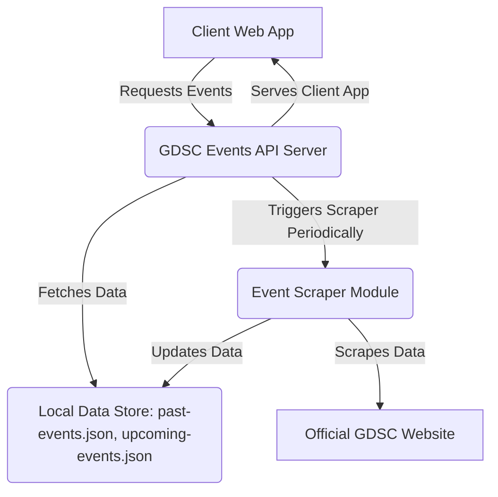
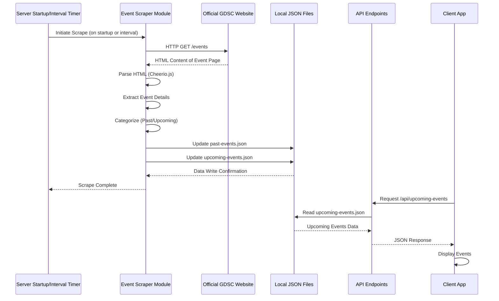

<!--
  Generated by AI-Powered README Generator
  Repository: https://github.com/GDSC-FSC/gdsc-farmingdale-links-api
  Generated: 2025-10-07T17:59:28.997Z
  Format: md
  Style: comprehensive
-->

# GDSC Farmingdale Events API


A robust API and accompanying web client to effortlessly fetch and display GDSC Farmingdale's past and upcoming events, scraped directly from the official GDSC website.

[](https://github.com/GDSC-FSC/gdsc-farmingdale-links-api/actions/workflows/pull_request.yaml)
[](LICENSE)
[](https://github.com/GDSC-FSC/gdsc-farmingdale-links-api/commits/main)
[](https://www.typescriptlang.org/)
[](https://nodejs.org/)
[](https://react.dev/)

---

## 🚀 Table of Contents

- [Overview](#-overview--introduction)
- [Feature Highlights](#-feature-highlights)
- [Architecture & Design](#-architecture--design--modules)
- [Getting Started](#-getting-started--installation--setup)
  - [Prerequisites](#prerequisites)
  - [Installation](#installation)
  - [Configuration](#configuration)
  - [Running the Application](#running-the-application)
- [Usage & Workflows](#-usage--workflows--examples)
  - [API Endpoints](#api-endpoints)
  - [Client Application](#client-application)
  - [Scraping Workflow](#scraping-workflow)
- [Limitations, Known Issues & Future Roadmap](#-limitations-known-issues--future-roadmap)
- [Contributing & Development Guidelines](#-contributing--development-guidelines)
- [License, Credits & Contact](#-license-credits--contact)
- [Appendix](#-appendix--optional-extras)
  - [Changelog](#changelog)
  - [FAQ](#faq)
  - [Troubleshooting](#troubleshooting)

---

## 📖 Overview / Introduction

The **GDSC Farmingdale Events API** is a full-stack application designed to automate the process of gathering and distributing event information for the Google Developer Student Club (GDSC) chapter at Farmingdale State College. It programmatically scrapes event data from the official GDSC website, stores it locally, and exposes it through a clean, well-defined RESTful API. An integrated client-side application provides a user-friendly interface to view these events.

**Purpose & Goals:**
*   **Automate Data Collection:** Eliminate the manual effort of searching for and compiling GDSC event details.
*   **Centralized Data Source:** Provide a single, reliable API endpoint for developers, club members, and external services to access event information.
*   **Structured Data:** Offer event data in a consistent, easy-to-consume JSON format.
*   **Enhance Accessibility:** Make GDSC Farmingdale events more discoverable and readily available.

**Why it Matters / Problem it Solves:**
Manually tracking upcoming and past events from dynamic web pages can be time-consuming and prone to errors. This application solves this by providing a reliable, automated solution that ensures event information is always up-to-date and accessible programmatically, facilitating integrations with other platforms or internal tools.

**Target Audience:**
*   **Developers:** Looking to integrate GDSC Farmingdale event data into their applications or websites.
*   **GDSC Farmingdale Members:** Seeking a centralized, up-to-date source for club events.
*   **Club Officers/Organizers:** To easily share and manage event information.
*   **External Integrators:** For displaying GDSC Farmingdale events on university portals or community calendars.

[⬆ Back to Top](#-table-of-contents)

---

## ✨ Feature Highlights

This application is packed with features to ensure seamless event data management and access:

### Data Acquisition & Management
*   ✅ **Automated Web Scraping:** Periodically scrapes GDSC Farmingdale's official website for event details, keeping data fresh and accurate.
*   🔄 **Scheduled Updates:** Configurable scraping interval (default weekly) ensures event data is always current without manual intervention.
*   💾 **Local Data Storage:** Events are stored in local JSON files (`past-events.json`, `upcoming-events.json`) for quick retrieval and resilience.
*   💡 **Error Handling for Scraping:** Built-in mechanisms to gracefully handle potential issues during the scraping process.

### API & Client Access
*   🚀 **RESTful API Endpoints:** Provides dedicated endpoints for fetching both past and upcoming events in a structured JSON format.
    *   `/api/past-events`
    *   `/api/upcoming-events`
    *   `/api/health`
*   🌐 **Integrated Client Application:** A responsive React-based front-end that consumes the API to display events in an intuitive user interface.
*   🔍 **Health Check Endpoint:** A simple `/api/health` endpoint to monitor the API's operational status.

### Development & Deployment
*   🐳 **Docker Support:** Containerized setup for easy deployment and consistent environments using `Dockerfile` and `compose.yaml`.
*   🛠️ **Type-Safe Development:** Built with TypeScript for enhanced code quality, maintainability, and fewer runtime errors.
*   ⚡ **Fast Development Server:** Utilizes Vite for a blazing-fast development experience for the client-side.
*   🧹 **Code Quality Tools:** Integrates Biome for robust linting and formatting, ensuring a consistent codebase.

[⬆ Back to Top](#-table-of-contents)

---

## 🏗️ Architecture & Design / Modules

The GDSC Farmingdale Events API follows a client-server architecture with a clear separation of concerns, enabling maintainability and scalability.

### High-Level Component Diagram



<details>
<summary>Click to view detailed Scraper Flow Diagram</summary>

```mermaid
graph TD
    A[Start] --> B{Is Scraper Enabled?};
    B -- Yes --> C[Schedule Scraping Job (e.g., weekly)];
    B -- No --> F[End];
    C --> D[Job Triggered];
    D -- Fetch Event Page HTML --> E(GDSC Website);
    E --> G[Parse HTML with Cheerio];
    G -- Extract Event Data --> H{Data Valid?};
    H -- No --> I[Log Error / Skip Event];
    H -- Yes --> J[Categorize: Past/Upcoming];
    J -- Store in Memory --> K(Update Data Objects);
    K -- Write to File System --> L(past-events.json, upcoming-events.json);
    L --> M[Keep-Alive Ping to Self (Optional)];
    M --> N[Job Complete];
    I --> N;
    N --> F;
```
</details>

### Explanation of Parts

*   **Client Web App (`src/client`):** A single-page application built with React and Vite. It's responsible for presenting the event data to the user through an intuitive UI. It communicates with the GDSC Events API Server to fetch event information.
*   **GDSC Events API Server (`src/server`):** The core backend service built with Node.js and Express.js.
    *   **Controllers:** Handle specific requests (e.g., `fileHandler.ts` for serving JSON, `scraper.ts` for managing scraping, `keepAlive.ts` for preventing idle shutdowns).
    *   **Routes:** Define the API endpoints (`health.ts`, `pastEvents.ts`, `upcomingEvents.ts`).
    *   **Middleware:** Manages cross-cutting concerns like error handling (`errors.ts`).
    *   **Data:** Contains the local JSON files (`past-events.json`, `upcoming-events.json`) that serve as the primary data store.
*   **Event Scraper Module (`src/server/controllers/scraper.ts`):** A critical component responsible for:
    *   Initiating HTTP requests to the official GDSC event pages (using Axios).
    *   Parsing the HTML content to extract structured event data (using Cheerio.js).
    *   Updating the local `past-events.json` and `upcoming-events.json` files.
    *   Operates on a defined schedule to keep data current.
*   **Local Data Store (`src/server/data/`):** Simple JSON files (`past-events.json`, `upcoming-events.json`) that act as a persistent cache for the scraped event data. This design choice prioritizes simplicity and quick deployment without needing a separate database service.
*   **Official GDSC Website:** The external source from which event information is scraped. The scraper is specifically designed for the GDSC Farmingdale chapter's event pages.

### Technology Stack Breakdown

*   **Backend (API Server):**
    *   **Runtime:** Node.js (LTS)
    *   **Framework:** Express.js
    *   **Language:** TypeScript
    *   **HTTP Client:** Axios
    *   **HTML Parser:** Cheerio.js
    *   **Tooling:** Nodemon (for dev), Biome (linting/formatting)
*   **Frontend (Client Web App):**
    *   **Library:** React
    *   **Build Tool:** Vite
    *   **Language:** TypeScript
    *   **Styling:** Plain CSS
*   **Deployment & Containerization:**
    *   **Container Runtime:** Docker
    *   **Orchestration:** Docker Compose
*   **Development Tools:**
    *   **Package Manager:** npm
    *   **Testing:** Jest
    *   **Version Control:** Git
    *   **Pre-commit Hooks:** Husky
    *   **CI/CD:** GitHub Actions

[⬆ Back to Top](#-table-of-contents)

---

## 🏁 Getting Started / Installation / Setup

Follow these steps to get the GDSC Farmingdale Events API and client application up and running on your local machine.

### Prerequisites

Ensure you have the following software installed on your system:

*   **Git**: [Download Git](https://git-scm.com/downloads) (latest stable version)
*   **Node.js**: [Download Node.js](https://nodejs.org/en/download/) (LTS version, v18 or higher recommended)
*   **npm**: Comes bundled with Node.js (latest stable version)
*   **Docker & Docker Compose**: [Download Docker Desktop](https://www.docker.com/products/docker-desktop/) (Optional, but highly recommended for containerized deployment)

### Installation

1.  **Clone the Repository:**

    ```bash
    git clone https://github.com/GDSC-FSC/gdsc-farmingdale-links-api.git
    ```

2.  **Navigate to the Project Directory:**

    ```bash
    cd gdsc-farmingdale-links-api
    ```

3.  **Install Dependencies:**
    This command will install all necessary Node.js packages for both the server and client.

    ```bash
    npm install
    ```

### Configuration

The application uses environment variables for configuration. A `.env.example` file is provided to help you set these up.

1.  **Create `.env` file:**
    Copy the example environment file:

    ```bash
    cp .env.example .env
    ```

2.  **Edit `.env`:**
    Open the newly created `.env` file and adjust the variables as needed.

    ```ini
    # .env
    PORT=3000
    SCRAPE_INTERVAL_MS=604800000 # Default: 1 week (7 days * 24 hours * 60 minutes * 60 seconds * 1000 milliseconds)
    # You might need to set an ALLOWED_ORIGIN if you're deploying with a separate frontend
    # ALLOWED_ORIGIN=http://localhost:5173
    ```

    *   `PORT`: The port on which the Express server will listen.
    *   `SCRAPE_INTERVAL_MS`: The interval in milliseconds between automated event scrapes.

    💡 **Tip:** For local development, `PORT=3000` is usually sufficient. A shorter `SCRAPE_INTERVAL_MS` (e.g., `30000` for 30 seconds) can be useful for testing the scraper's functionality. Remember to revert for production.

### Running the Application

You can run the application in development mode (with hot-reloading) or production mode (optimized).

#### Development Mode (Recommended for local development)

This command starts both the client (Vite dev server) and the server (Nodemon for auto-restart) simultaneously.

```bash
npm run dev
```

*   The **client application** will typically be accessible at `http://localhost:5173`.
*   The **API server** will listen on `http://localhost:3000` (or your configured `PORT`).

Changes to source files will trigger automatic recompilation and hot-reloading for the client, and server restarts for the backend.

#### Production Mode

This builds the client application and starts the server in a production-optimized environment.

1.  **Build the Client Application:**
    This command compiles the React client into static files in the `dist` directory.

    ```bash
    npm run build
    ```

2.  **Start the Server:**

    ```bash
    npm start
    ```

    The server will now serve both the static client files and the API endpoints. The application will be available at `http://localhost:3000` (or your configured `PORT`).

#### Running with Docker (Recommended for production deployment)

Docker provides a consistent environment and simplifies deployment.

1.  **Build and Run Containers:**
    Navigate to the project root where `compose.yaml` is located.

    ```bash
    docker compose up --build -d
    ```
    *   `--build`: Builds the Docker images before starting the containers (only needed on first run or after Dockerfile changes).
    *   `-d`: Runs the containers in detached mode (in the background).

2.  **Verify Running Containers:**

    ```bash
    docker compose ps
    ```

3.  **Access the Application:**
    The application will be available at `http://localhost:3000`.

4.  **Stop Containers:**

    ```bash
    docker compose down
    ```

[⬆ Back to Top](#-table-of-contents)

---

## 🚀 Usage / Workflows / Examples

This section describes how to interact with the API and the integrated client application.

### API Endpoints

The API provides simple GET endpoints to retrieve event data. All responses are in JSON format.

#### 1. Get Upcoming Events

*   **Endpoint:** `/api/upcoming-events`
*   **Method:** `GET`
*   **Description:** Retrieves a list of events scheduled for the future.
*   **Example Request (cURL):**

    ```bash
    curl http://localhost:3000/api/upcoming-events
    ```

*   **Example Response (JSON):**
    ```json
    [
      {
        "title": "React Workshop",
        "date": "2024-10-26",
        "time": "14:00 PM",
        "location": "Virtual",
        "link": "https://gdsc.community.dev/events/details/..."
      },
      {
        "title": "Machine Learning Fundamentals",
        "date": "2024-11-15",
        "time": "18:00 PM",
        "location": "Campus Center, Room 201",
        "link": "https://gdsc.community.dev/events/details/..."
      }
    ]
    ```

#### 2. Get Past Events

*   **Endpoint:** `/api/past-events`
*   **Method:** `GET`
*   **Description:** Retrieves a list of events that have already occurred.
*   **Example Request (cURL):**

    ```bash
    curl http://localhost:3000/api/past-events
    ```

*   **Example Response (JSON):**
    ```json
    [
      {
        "title": "Intro to Web Development",
        "date": "2023-09-01",
        "time": "10:00 AM",
        "location": "Greenley Hall, Lab 105",
        "link": "https://gdsc.community.dev/events/details/..."
      },
      {
        "title": "Cloud Study Jam",
        "date": "2023-09-20",
        "time": "16:00 PM",
        "location": "Virtual",
        "link": "https://gdsc.community.dev/events/details/..."
      }
    ]
    ```

#### 3. Health Check

*   **Endpoint:** `/api/health`
*   **Method:** `GET`
*   **Description:** A simple endpoint to check if the API server is running.
*   **Example Request (cURL):**

    ```bash
    curl http://localhost:3000/api/health
    ```

*   **Example Response (JSON):**
    ```json
    {
      "status": "up",
      "timestamp": "2024-07-20T12:34:56.789Z"
    }
    ```

### Client Application

The integrated React client application (available at the root URL, e.g., `http://localhost:3000` when running in production mode or `http://localhost:5173` in development mode) provides a user-friendly interface to browse events.

**Key Interactions:**
*   **Navigation:** Use the built-in navigation to switch between "Upcoming Events" and "Past Events."
*   **Event Details:** Click on an event card to view more details or be redirected to the official GDSC event page.

### Scraping Workflow

The event data is automatically updated by the scraper based on the `SCRAPE_INTERVAL_MS` environment variable.

<details>
<summary>Detailed Scraping Workflow (Mermaid)</summary>


</details>

*   **Initial Scrape:** When the server first starts, it will attempt to perform an initial scrape to populate the data files.
*   **Scheduled Scrapes:** After the initial scrape, the scraper will run automatically at the interval defined by `SCRAPE_INTERVAL_MS`.
*   **Data Availability:** The API will always serve the latest data available in the local JSON files, which are updated by the scraper.

[⬆ Back to Top](#-table-of-contents)

---

## 🚧 Limitations, Known Issues & Future Roadmap

Understanding the current state and future direction is crucial for any project.

### Current Limitations

*   **Single Source Scraping:** The scraper is tailored specifically for the GDSC Farmingdale event page structure. Changes to the upstream website's HTML structure might break the scraper.
*   **Local File Storage:** Event data is stored in flat JSON files. While simple and effective for this scale, it's not suitable for very large datasets, complex queries, or multi-instance deployments requiring shared state.
*   **No Admin Interface:** There's no dedicated administrative interface to manually trigger scrapes, edit events, or manage scraper settings beyond environment variables.
*   **Read-Only API:** The API is purely for reading event data; there are no endpoints for adding, updating, or deleting events.
*   **Limited Error Reporting:** While errors are logged, advanced reporting or alerting for scraper failures is not implemented.

### Known Issues

*   ⚠️ **Scraper Fragility:** As noted in `dev-note.txt`, significant changes to the GDSC website's CSS or HTML structure may require updates to the `scraper.ts` parsing logic. If the API returns empty arrays or incorrect data after a period of working correctly, investigate changes on the GDSC event page.
*   **Initial Load Delay:** On the very first run (or if `past-events.json`/`upcoming-events.json` are empty), the API might serve empty data until the initial scrape completes.

### Future Roadmap

We are continuously looking to enhance the GDSC Farmingdale Events API. Here are some planned and potential future enhancements:

*   **Database Integration:** Replace local JSON files with a proper database (e.g., PostgreSQL, MongoDB) for improved scalability, query capabilities, and data persistence across multiple instances.
*   **Admin Dashboard:** Implement a basic web-based admin panel for:
    *   Manually triggering scrapes.
    *   Viewing scraper logs and status.
    *   Managing event data (CRUD operations) for manual overrides.
*   **Enhanced Error Handling & Alerts:** Implement more robust error handling for scraping, potentially integrating with alerting services (e.g., email, Slack) for critical failures.
*   **API Authentication:** For write operations (if implemented) or restricted read access, add API key or OAuth-based authentication.
*   **More Advanced Scraper:**
    *   Support for multiple GDSC chapters.
    *   More resilient parsing logic using AI/ML or more flexible selectors.
*   **Caching Layer:** Implement a caching mechanism (e.g., Redis) to further reduce load on the API server and speed up response times.
*   **Container Orchestration:** Provide Kubernetes manifests or similar for advanced, highly available deployments.
*   **PWA Enhancements:** Further develop the client-side as a Progressive Web App for offline capabilities and a native app-like experience.

💡 **Feature Requests:** We welcome your ideas! Please open a GitHub Issue to suggest new features or improvements.

[⬆ Back to Top](#-table-of-contents)

---

## 🤝 Contributing & Development Guidelines

We welcome contributions to the GDSC Farmingdale Events API! By contributing, you can help improve this valuable resource for the community.

### How to Contribute

1.  **Fork the Repository:** Start by forking the `gdsc-farmingdale-links-api` repository to your GitHub account.
2.  **Clone Your Fork:**

    ```bash
    git clone https://github.com/YOUR_USERNAME/gdsc-farmingdale-links-api.git
    cd gdsc-farmingdale-links-api
    ```

3.  **Create a New Branch:**
    For each new feature or bug fix, create a new branch from `main`. Use descriptive names like `feat/add-caching` or `fix/scraper-date-parsing`.

    ```bash
    git checkout -b feature/your-feature-name main
    ```

4.  **Make Your Changes:**
    Implement your feature or fix the bug. Ensure your code adheres to the project's coding standards.

5.  **Test Your Changes:**
    Write or update unit/integration tests as appropriate. Run existing tests to ensure no regressions.

    ```bash
    npm test
    ```

6.  **Commit Your Changes:**
    Write clear, concise commit messages that explain your changes.

    ```bash
    git commit -m "feat: Add new awesome feature"
    ```

7.  **Push to Your Fork:**

    ```bash
    git push origin feature/your-feature-name
    ```

8.  **Create a Pull Request (PR):**
    Open a Pull Request from your branch on your forked repository to the `main` branch of the original `GDSC-FSC/gdsc-farmingdale-links-api` repository.
    *   **Provide a detailed description** of your changes in the PR.
    *   **Reference any relevant issues** (e.g., `Closes #123`).
    *   **Include screenshots or GIFs** if your changes affect the UI.

### Branch & Pull Request Guidelines

*   **Branch Naming:** Use `feature/<name>`, `fix/<name>`, `chore/<name>`, `docs/<name>`, etc.
*   **PR Reviews:** All pull requests require at least one approving review before merging.
*   **Automated Checks:** Ensure all GitHub Actions (CI/CD workflows) pass before requesting a review.
*   **Merge Squashing:** Small, related commits might be squashed into a single, meaningful commit during the merge process.

### Code Style, Testing, and Linting

*   **Code Style:** This project uses [Biome](https://biomejs.dev/) for linting and formatting. It's configured via `biome.json`.
    *   Your code will be automatically checked by a `pre-commit` hook (managed by Husky).
    *   To manually format and lint:
        ```bash
        npm run format
        npm run lint
        ```
*   **Testing:** We use [Jest](https://jestjs.io/) for unit and integration testing.
    *   Tests are located alongside the code they test (e.g., `server.test.ts` for `server.ts`).
    *   Run tests: `npm test`
    *   Run tests with coverage: `npm test -- --coverage` (or `npm run test:coverage`)

### Development Setup

*   **IDE Configuration:** We recommend using VS Code with extensions for TypeScript, ESLint (if not using Biome's native integration), and Prettier (if not relying solely on Biome). Ensure your IDE integrates with the `biome.json` settings.
*   **Environment Variables:** Always use a `.env` file for local development. Do **not** commit your `.env` file. Refer to `.env.example`.

[⬆ Back to Top](#-table-of-contents)

---

## 📜 License, Credits & Contact

### License

This project is licensed under the **MIT License**.

You are free to use, modify, and distribute this software, subject to the conditions outlined in the [LICENSE](LICENSE) file in the repository.

### Acknowledgments & Dependencies

This project stands on the shoulders of many excellent open-source libraries and tools. We extend our gratitude to the creators and maintainers of:

*   **Node.js**: JavaScript runtime environment.
*   **Express.js**: Fast, unopinionated, minimalist web framework for Node.js.
*   **TypeScript**: A typed superset of JavaScript that compiles to plain JavaScript.
*   **React**: A JavaScript library for building user interfaces.
*   **Vite**: A fast frontend build tool.
*   **Axios**: Promise-based HTTP client for the browser and node.js.
*   **Cheerio.js**: Fast, flexible, and lean implementation of core jQuery for the server.
*   **Docker**: For containerization.
*   **Biome**: A toolchain for web projects, providing formatting and linting.
*   **Jest**: A delightful JavaScript testing framework.
*   **Nodemon**: Utility to monitor for any changes in your source and automatically restart your server.
*   **Husky**: Git hooks made easy.

### Contact

For any questions, suggestions, or collaborations, please:

*   **Open a GitHub Issue**: For bug reports, feature requests, or general discussions.
*   **GDSC Farmingdale GitHub Organization**: [GDSC-FSC](https://github.com/GDSC-FSC)

[⬆ Back to Top](#-table-of-contents)

---

## 📚 Appendix / Optional Extras

### Changelog

#### v1.0.0 - Initial Release (YYYY-MM-DD)
*   Core API for scraping and serving GDSC Farmingdale events.
*   Endpoints for `past-events` and `upcoming-events`.
*   Integrated React client application for event display.
*   Automated scraping with configurable interval.
*   Docker and Docker Compose support for easy deployment.
*   Comprehensive development tooling (TypeScript, Biome, Jest).

### FAQ

<details>
<summary>Q: How often is the event data updated?</summary>
A: By default, the event data is scraped and updated weekly. This interval can be configured via the `SCRAPE_INTERVAL_MS` environment variable. You can set it to a shorter duration for testing or a longer one for less frequent updates.
</details>

<details>
<summary>Q: Can I use this API for other GDSC chapters?</summary>
A: The current scraper is specifically designed for the HTML structure of the GDSC Farmingdale event page. To support other chapters, the `scraper.ts` logic would need to be modified to accommodate their specific website layouts. This is a potential future enhancement.
</details>

<details>
<summary>Q: What happens if the GDSC website structure changes?</summary>
A: If the official GDSC website changes its HTML or CSS structure relevant to event listings, the scraper might break or return incorrect data. In such cases, the `src/server/controllers/scraper.ts` file will need to be updated to reflect the new structure.
</details>

<details>
<summary>Q: Is there any authentication required to access the API?</summary>
A: Currently, all API endpoints (`/api/past-events`, `/api/upcoming-events`, `/api/health`) are publicly accessible without any authentication. This is suitable for general data consumption but would require modification if write access or restricted read access is desired in the future.
</details>

<details>
<summary>Q: Can I contribute to the project?</summary>
A: Absolutely! We welcome contributions. Please refer to the [Contributing & Development Guidelines](#-contributing--development-guidelines) section for details on how to get involved.
</details>

### Troubleshooting

<details>
<summary>Q: The server starts, but the API returns empty arrays for events.</summary>
A:
1.  **Check Scraper Logs:** Review the server logs for any errors related to scraping (e.g., "Error scraping events"). This usually indicates an issue with fetching the page or parsing its content.
2.  **Verify GDSC Website:** Manually visit the GDSC Farmingdale events page (e.g., `https://gdsc.community.dev/farmingdale-state-college/`) to ensure it's accessible and events are listed.
3.  **Inspect Scraper Code:** If the website structure has changed, the scraper's parsing logic (`src/server/controllers/scraper.ts`) might need updates.
4.  **Initial Scrape Time:** On first startup, the server might take a moment to perform the initial scrape. Wait a minute or two and try again.
5.  **Environment Variables:** Ensure `SCRAPE_INTERVAL_MS` is correctly set in your `.env` file (for testing, you might temporarily set it to a very short interval like `30000` ms for 30 seconds).
</details>

<details>
<summary>Q: `npm run dev` fails with a port conflict error.</summary>
A:
1.  **Identify Conflicting Process:** An error message like "Port 3000 already in use" means another application is using that port.
    *   **Linux/macOS:** `sudo lsof -i :3000`
    *   **Windows:** `netstat -ano | findstr :3000`
2.  **Terminate Process:**
    *   **Linux/macOS:** `kill -9 <PID>` (replace `<PID>` with the process ID)
    *   **Windows:** `taskkill /PID <PID> /F`
3.  **Change Port:** Alternatively, you can change the `PORT` environment variable in your `.env` file to another available port (e.g., `3001`).
</details>

<details>
<summary>Q: Docker containers are not starting or exiting immediately.</summary>
A:
1.  **Check Container Logs:** View the logs of the failing container to diagnose the issue:
    ```bash
    docker compose logs server
    ```
2.  **Inspect `Dockerfile` and `compose.yaml`:** Ensure there are no syntax errors or misconfigurations.
3.  **Resource Constraints:** Check if your system has sufficient resources (memory, CPU) for the Docker containers.
4.  **Dependencies:** Ensure all `npm install` steps completed successfully during the build process.
</details>

### API Reference

Detailed information on API endpoints, request formats, and response structures can be found in the [Usage & Workflows](#-usage--workflows--examples) section of this README.

[⬆ Back to Top](#-table-of-contents)